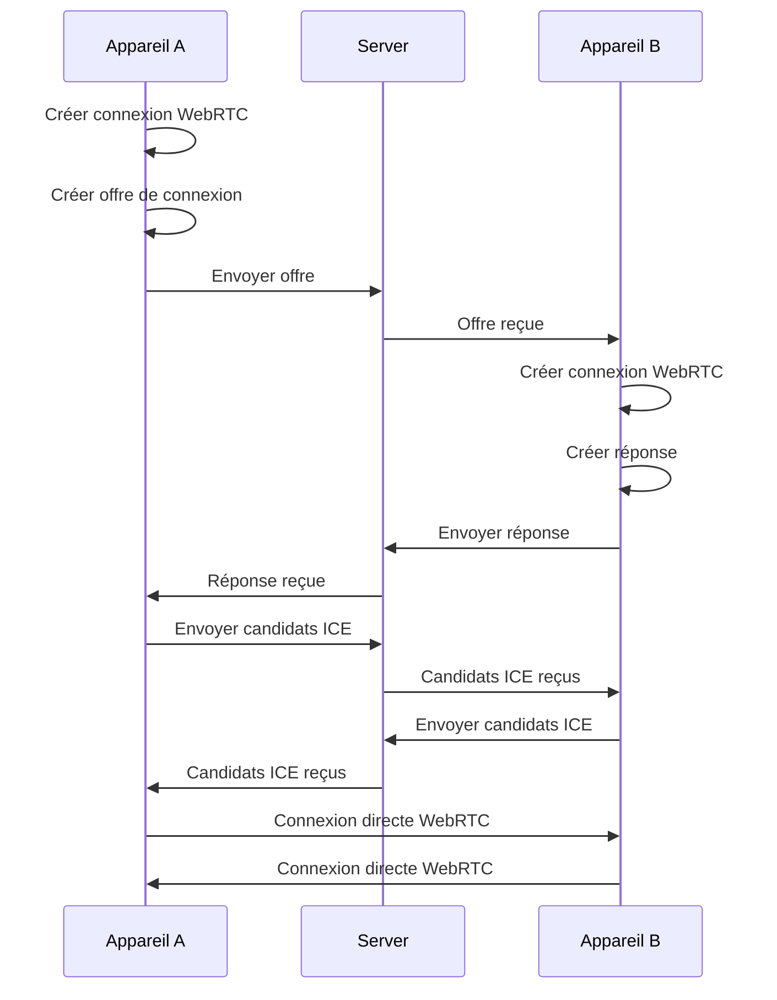
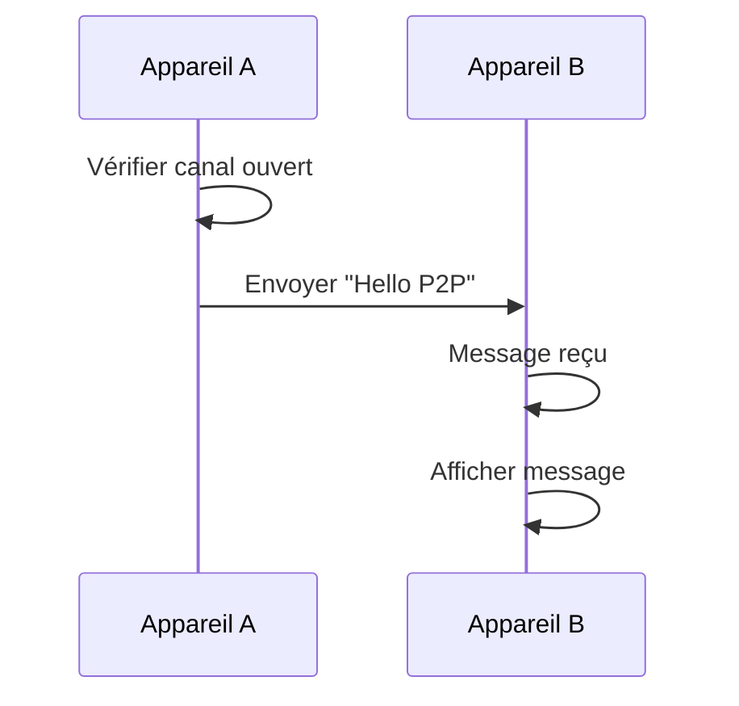
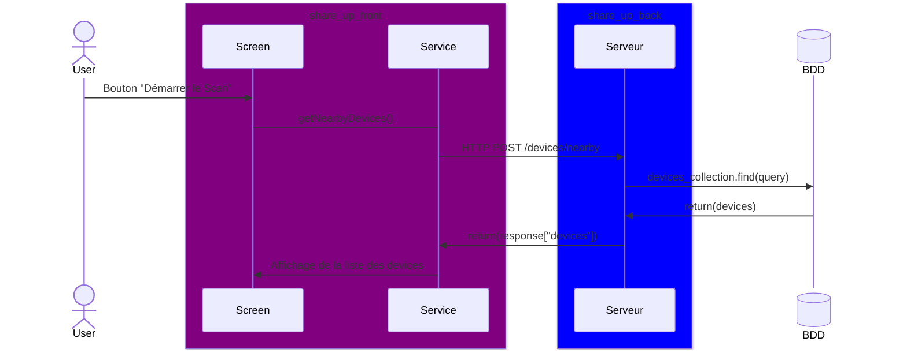

# Diagramme de séquence - Connexion P2P (Simple)

```mermaid
sequenceDiagram
    participant A as Appareil A
    participant API as Server
    participant B as Appareil B

    A->>A: Créer connexion WebRTC
    A->>A: Créer offre de connexion
    A->>API: Envoyer offre
    API->>B: Offre reçue

    B->>B: Créer connexion WebRTC
    B->>B: Créer réponse
    B->>API: Envoyer réponse
    API->>A: Réponse reçue

    A->>API: Envoyer candidats ICE
    API->>B: Candidats ICE reçus
    B->>API: Envoyer candidats ICE
    API->>A: Candidats ICE reçus

    A->>B: Connexion directe WebRTC
    B->>A: Connexion directe WebRTC
```

# Diagramme de séquence - Messages P2P (Simple)

```mermaid
sequenceDiagram
    participant A as Appareil A
    participant B as Appareil B

    A->>A: Vérifier canal ouvert
    A->>B: Envoyer "Hello P2P"
    B->>B: Message reçu
    B->>B: Afficher message
```

# Diagramme de séquence - Scan des appareils à proximité

```mermaid
sequenceDiagram
actor U as User

    box purple share_up_front 
    participant X as Screen
    participant A as Service
    end

    box blue share_up_back
    participant S as Serveur
    end

    participant BDD@{ "type" : "database" }

    U->>X: Bouton "Démarrer le Scan"
    X->A: getNearbyDevices()
    A->>S: HTTP POST /devices/nearby
    S->>BDD: devices_collection.find(query)
    BDD->>S: return(devices)
    S->>A: return(response["devices"])
    A->>X: Affichage de la liste des devices
```