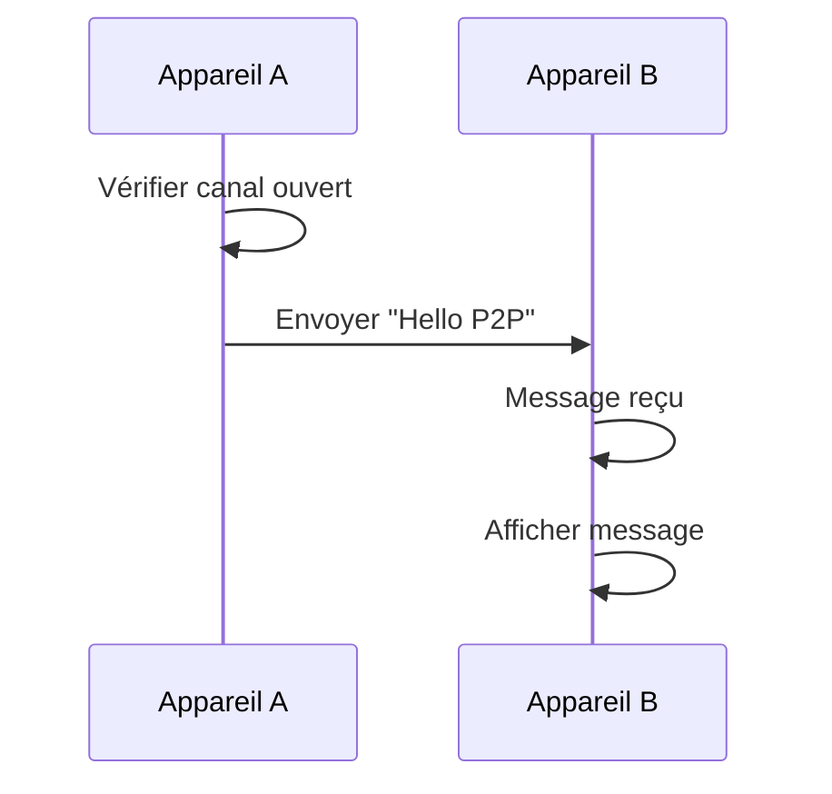

# Diagramme de séquence - Messages P2P (Simple)

```mermaid
sequenceDiagram
    participant A as Appareil A
    participant B as Appareil B

    A->>A: Vérifier canal ouvert
    A->>B: Envoyer "Hello P2P"
    B->>B: Message reçu
    B->>B: Afficher message
```
